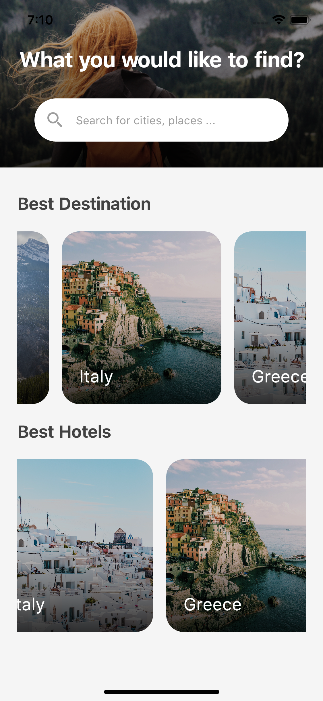

## Flutter Simple Travel Application UI Design

**Travel_application** est une application Flutter qui permet aux utilisateurs de découvrir et rechercher des destinations de voyage, des hôtels et des lieux populaires. L'application offre une interface utilisateur élégante avec des images en fond et des options de recherche.
So Let's create a beautiful and animated Simple Travel Application UI with Flutter.

### [Watch it on Youtube](https://youtu.be/_yQm7FsxE98)


## Development Setup
Clone the repository and run the following commands:
```
flutter pub get
flutter run
```

## ScreenShots

&nbsp;


## Fonctionnalités

- Rechercher des destinations et des lieux à visiter.
- Explorer les meilleures destinations, hôtels, et lieux populaires.
- Interface utilisateur moderne avec des images et des gradients attrayants.


## Structure du Projet

**lib/**: Contient le code source de l'application.

  - **main.dart**: Point d'entrée principal de l'application. Il configure le thème et lance la page d'accueil `HomePage`.
  
  - **pages/**
    - **home_page.dart**: Contient la logique et l'interface de la page d'accueil de l'application. La page d'accueil inclut une image d'arrière-plan, un champ de recherche pour trouver des destinations, et des sections pour explorer les meilleures destinations, hôtels, et lieux populaires.

## Description des fichiers

<details>
<summary>1.1 main.dart</summary>

- Ce fichier est le point d'entrée de l'application. Il configure le thème de l'application et initialise la page d'accueil. Voici une explication des éléments clés :

    - **MyApp**:
        Classe principale de l'application qui hérite de `StatelessWidget`. Elle définit le thème de l'application avec `ThemeData` et utilise `MaterialApp` pour configurer la navigation et les paramètres globaux.

    - **home**:
        L'élément `home` de `MaterialApp` est défini sur `HomePage`, ce qui signifie que lorsque l'application est lancée, la première page affichée est `HomePage`.

</details>

<details>
<summary>1.2 home_page.dart</summary>

- Ce fichier contient la logique et l'interface utilisateur pour la page d'accueil de l'application. Voici une explication détaillée des sections clés :

    - **Scaffold**:
        Utilisé pour la structure de base de la page, incluant l'arrière-plan, le `SingleChildScrollView` pour permettre le défilement, et la disposition générale des éléments.

    - **Container (Arrière-plan)**:
        Ce container occupe 300 pixels de hauteur et utilise une image d'arrière-plan définie par `AssetImage`. Un gradient sombre est appliqué pour améliorer la lisibilité du texte.

    - **TextField (Recherche)**:
        Un champ de recherche est inclus sous l'image d'arrière-plan, permettant aux utilisateurs de rechercher des villes ou des lieux. Il est stylisé avec un `borderRadius` et des icônes.

    - **ListView (Destinations, Hôtels, Lieux Populaires)**:
        Plusieurs `ListView` horizontaux permettent de naviguer entre les différentes sections : Meilleures Destinations, Meilleurs Hôtels, et Lieux Populaires. Chaque item est généré par la méthode `makeItem` qui crée une carte avec une image et un titre.

    - **makeItem**:
        Cette méthode prend une image et un titre en paramètres et retourne un widget stylisé avec une `AspectRatio` de 1:1, une image en arrière-plan, un gradient, et le titre en bas à gauche.

</details>
